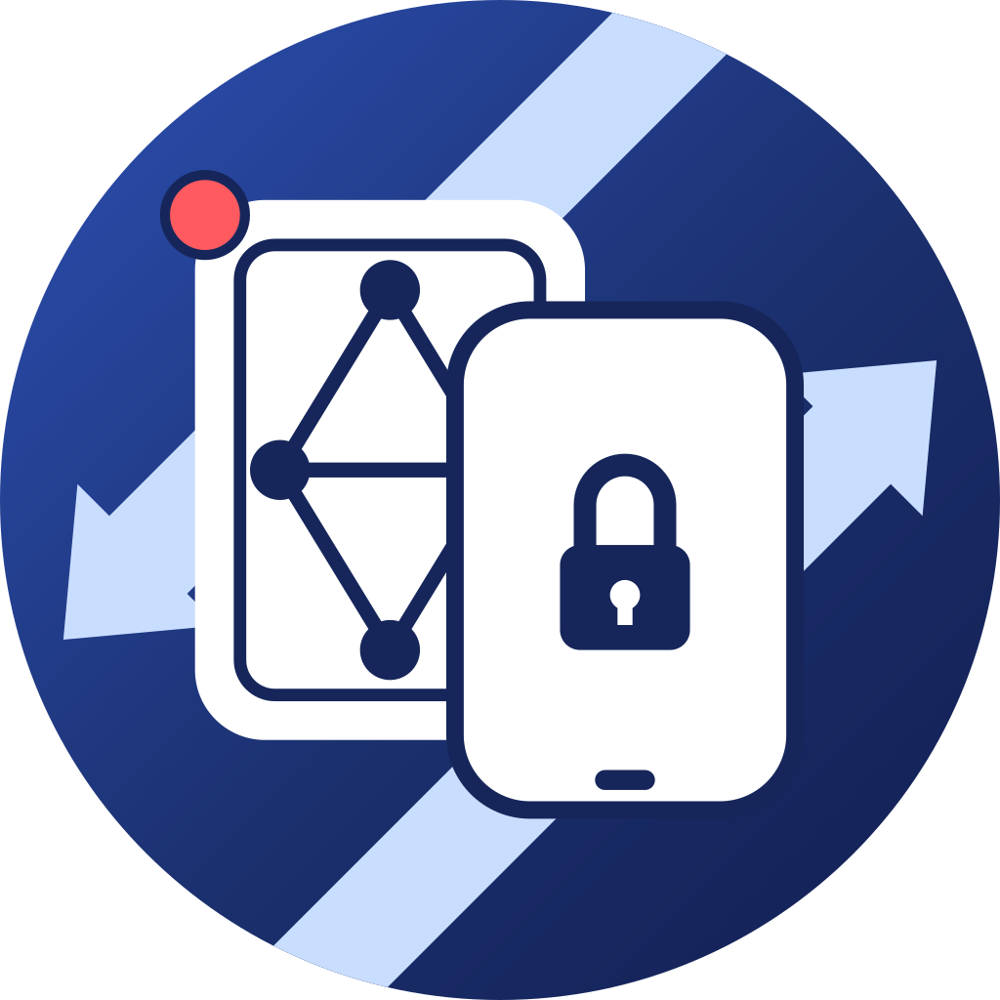

  

<h1 align="center">NotiSync</h1>

  Notifications across your devices. End-to-end encrypted.

  <a href="https://play.google.com/store/apps/details?id=net.extrawdw.apps.notisync">Google Play</a> ·
  <a href="https://apps.apple.com/app/notisync/id6784461695">App Store</a> ·
  <a href="docs/desktop.md">Desktop setup</a> ·
  <a href="https://notisync.apps.extrawdw.net/">Website</a> ·
  <a href="docs/README.md">Documentation</a>

NotiSync mirrors notifications from the apps you choose to your other devices, with supported actions, inline replies, and synchronized dismissals. Pair your devices, choose what to share, and keep notification content encrypted from sender to recipient. The broker relays encrypted messages and routing metadata; it does not receive plaintext notification content.

## What you can do

- **Keep notifications in sync.** Mirror selected Android apps, reply or use supported actions from another device, and synchronize dismissals.
- **Connect an iPhone.** Receive mirrored notifications in the iOS app, or use an Android device's Bluetooth bridge to forward iPhone notifications without an iOS companion app.
- **Follow terminal work with [Run](docs/desktop.md#notisync-run).** Watch command output, answer supported prompts, and control a process from Android.
- **Create Git signatures remomtely with [Seal](docs/seal.md).** Sign commits and annotated tags using OpenKeychain on a trusted Android device.
- **Use your phone as an [SSH key provider](docs/ssh-agent.md).** Connect standard SSH clients to NotiSync SSH Agent and approve signing requests on a trusted device.
- **Share an Android screen.** View and control Android devices with experimental [screen sharing](docs/screen-sharing.md) (requires [Shizuku](https://github.com/rikkaapps/shizuku)).

## Platform support

| Platform | Requirements | Role |
| --- | --- | --- |
| Android | Android 14+ | Capture and receive notifications, iPhone Bluetooth bridge, Run, Seal, SSH key provider, and screen sharing |
| iPhone / iPad | iOS / iPadOS 18.6+ | Receive notifications, screen sharing viewer, and SSH key provider |
| Linux / macOS | JDK 21+; [build prerequisites](docs/desktop.md#prerequisites) | Peer daemon and CLI, Run, Seal, SSH Agent, and screen viewer |
| Windows | JDK 21+; [build prerequisites](docs/desktop.md#prerequisites) | Peer daemon and CLI, Seal, and SSH Agent |

The iOS app cannot capture other apps' notifications directly. Forwarding iPhone notifications requires a nearby Android device running the Bluetooth bridge. Desktop tools provide command-line integration; they do not provide a system notification viewer.

## Get started

1. Install the app on your phones or tablets (including [Mac computers with Apple silicon](https://support.apple.com/en-us/116943)) using the links above.
2. Grant notification permissions during onboarding. On Android, enable notification access if you want to forward notifications from that device.
3. [Pair your devices](#device-pairing) using QR codes or NFC, and verify each device before trusting it.
4. On Android, open **Apps** and enable the apps you want to mirror. Nothing is forwarded until you choose your apps.
5. To use advanced features like Run, Seal and SSH Agent, follow [desktop setup](docs/desktop.md) to install on a computer.

The apps use the default broker out of the box. You can also [host your own broker](docs/self-hosting.md). See [getting started](docs/getting-started.md) for mutual pairing, the iPhone bridge, and custom brokers.

> [!IMPORTANT]
> FCM/APNs push delivery will not work with the production Google Play or App Store builds when using your own broker. Push delivery requires your own app builds and matching credentials; see the [self-hosting limitation](docs/self-hosting.md#push-delivery-limitation).

## Device pairing

- **QR codes:** Open **Devices → Pair a device**, show one device's code, and scan it with the other. Exchange codes in both directions so both devices can verify and trust one another. You can also share a pairing link.
- **NFC:** On Android, open **Pair a device** screen on the scanning phone and tap it against an unlocked Android device with NotiSync installed. Keep the other device's pairing screen closed. On a supported iPhone, use **Pair via NFC** or the NFC icon to scan the Android device. Keep the devices together until the exchange finishes, then verify and confirm trust on both. The NFC coil location varies by device

> [!TIP]
> On some Chinese OEM phones (CN firmware), setting the manufacturer's wallet as the default wallet app blocks other apps' Host Card Emulation (HCE), so another device cannot read NotiSync's pairing information from that phone over NFC. The affected phone can still scan another compatible Android device over NFC.

See the [pairing guide](docs/getting-started.md#device-pairing) for step-by-step instructions and [desktop pairing](docs/desktop.md#pair-with-a-phone) for computers.

## Documentation

| Guide | Contents |
| --- | --- |
| [Getting started](docs/getting-started.md) | Permissions, QR/NFC pairing, app selection, and iPhone bridge |
| [Desktop tools](docs/desktop.md) | Installation, daemon lifecycle, Run, and agent skills |
| [NotiSync Seal](docs/seal.md) | OpenKeychain setup, Git signing, verification, and rollback |
| [SSH Agent](docs/ssh-agent.md) | Phone key providers, SSH clients, Windows/WSL setup, and troubleshooting |
| [Screen sharing](docs/screen-sharing.md) | Requirements, desktop viewer, and direct / relay transport |
| [Self-hosting](docs/self-hosting.md) | Broker deployment, push delivery, authentication, and configuration |
| [Development](docs/development.md) | Build Android, iOS, desktop, and server components; tests and contributions |
| [Architecture](docs/architecture.md) | Repository modules and message delivery |
| [Security model](docs/security.md) | Encryption, device trust, key storage, and broker visibility |
| [Troubleshooting](docs/troubleshooting.md) | Delivery, pairing, desktop diagnostics, and Windows SSH output |

## Feedback and contributions

Report bugs or suggest improvements through [GitHub Issues](https://github.com/dingwen07/NotiSync/issues). For code changes, start with the [development guide](docs/development.md#contributing). The [privacy policy](https://notisync.apps.extrawdw.net/privacy/) describes the published apps' data handling.

## License

The repository's default license is [Apache License 2.0](LICENSE). The broker in `server/` has a separate [GNU AGPL v3 license](server/LICENSE). Third-party components retain their own licenses; see the [screen mirroring notices](SCREEN_MIRRORING_THIRD_PARTY.md) for the bundled screen stack.
