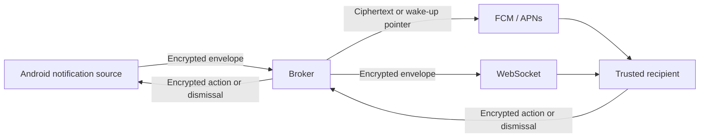

# Architecture

[Documentation](README.md) · [Security model](security.md) · [Development](development.md)

NotiSync is a device-to-device trust network with a relay broker. Android captures selected
notifications, trusted recipients decrypt and present them, and actions or dismissals can travel
back through the same encrypted messaging system.

## Message delivery

The broker verifies signatures and routes messages by recipient ID. Small encrypted messages
can fit in platform push payloads; larger ones use a pointer so the recipient can fetch the
encrypted relay item. WebSocket connections support live delivery. Private assets are encrypted
before upload and fetched by recipients as needed.

An Android Bluetooth bridge can also capture iPhone notifications via ANCS and feed them into
this flow. The iOS app itself is a notification receiver. Desktop feature clients communicate
with `notisyncd` through a local API, and the daemon handles encrypted peer messaging.

## Repository map

The root [Gradle settings](../settings.gradle.kts) define the JVM/Android modules. The native iOS
project lives under `ios/` and consumes the shared protocol as an XCFramework.

| Module or directory | Responsibility |
| --- | --- |
| [`protocol`](../protocol/) | Kotlin Multiplatform wire types, compact CBOR/JSON codecs, cipher-suite identifiers, transport interface, and iOS codec facade |
| [`protocol-crypto`](../protocol-crypto/) | JVM envelope encryption, HPKE, ECDSA verification, identity fingerprints, and key-epoch verification |
| [`peer-core`](../peer-core/) | Shared JVM peer engine: secure channel, trust convergence, pairing, key rotation, and broker transport |
| [`protocol-local`](../protocol-local/) | JSON DTOs for the desktop local API |
| [`local-client`](../local-client/) | Desktop local API client, streaming, daemon autostart, platform paths, and private-file helpers |
| [`app`](../app/) | Android Compose client: notification capture/display, actions, pairing, phone tools, and platform integrations |
| [`ios`](../ios/) | Swift client, shared kit, notification service/content extensions, and platform key storage |
| [`server`](../server/) | Ktor CIO broker, authenticated WebSocket delivery, FCM/APNs adapters, and Exposed/SQLite cache |
| [`notisyncd`](../notisyncd/) | Peer daemon, `notisync` management CLI, desktop distribution, and bundled agent skills |
| [`nsrun`](../nsrun/) | Command supervision, terminal integration, Run logs/configuration, and daemon reporting |
| [`notisync-gpg`](../notisync-gpg/) | GPG adapter for remote commit/tag signing with Seal |
| [`notisync-ssh-agent`](../notisync-ssh-agent/) | Desktop SSH agent endpoints and remote signing coordination |
| [`ssh-agent-core`](../ssh-agent-core/) | Shared SSH wire types, key handling, and signing utilities |
| [`screen-session`](../screen-session/) | Shared screen session, transport, and control logic |
| [`scrcpy-server`](../scrcpy-server/) | Vendored Android capture/input integration |
| [`nsscreen`](../nsscreen/) | POSIX screen CLI and native SDL/FFmpeg viewer |

## Shared protocol, platform integrations

Android, the desktop tools, and the broker share JVM protocol and cryptographic code. iOS consumes
the Kotlin Multiplatform codec and implements cryptography with CryptoKit and platform key storage.
Sharing the codec keeps serialized signed payloads consistent across platforms; it does not mean
that every platform uses the same crypto implementation.

The current wire suite is **NS2**, with compact numeric CBOR labels, delegated operational keys,
and key epochs. The server requires NS2 under `/v2`; the retained NS1 identifier is not a
compatibility implementation. See [security](security.md) for the trust and encryption details.

Screen sessions use a separate media/control transport after peer authorization; see
[screen sharing](screen-sharing.md#transport) and the [native helper](../nsscreen/src/native/README.md).
